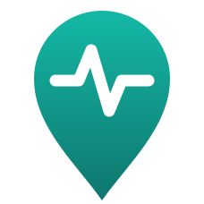

# GeoPulse for Home Assistant



Connects Home Assistant with [GeoPulse](https://github.com/tess1o/geopulse),
the self-hosted, privacy-first location timeline — in both directions:

- **Import:** GeoPulse positions become `device_tracker` entities in Home
  Assistant: your whole account, individual GeoPulse location sources, and
  friends who share their live location with you.
- **Export:** Home Assistant `device_tracker`s (e.g. the Companion app) are
  sent to GeoPulse, with a retry queue that survives outages and restarts.
  This replaces GeoPulse's manual `rest_command` + automation recipe.
- **Timeline card:** a dashboard card with a map and a list of stays and
  trips for any date range, for you and friends sharing their timeline.

GeoPulse stays the only place your location *history* lives: imported
trackers only ever hold the current position, and their coordinates are
kept out of Home Assistant's database by default.


> This is a community project, not affiliated with GeoPulse.

## Requirements

- Home Assistant **2026.9** or newer
- A GeoPulse server reachable from Home Assistant
- A GeoPulse **API token** for the account you want to import from
  (GeoPulse → *Settings → API Tokens*)

## Installation

### HACS (recommended)

1. HACS → ⋮ → *Custom repositories* → add
   `https://github.com/blauvster/ha-geopulse`, type **Integration**.
2. Install **GeoPulse**, then restart Home Assistant.

### Manual

Copy `custom_components/geopulse/` into your Home Assistant `config/custom_components/`
folder and restart.

## Setup

*Settings → Devices & services → Add integration → GeoPulse.*

1. **Connection** — your GeoPulse URL (e.g. `http://geopulse.lan:8080`) and
   your API token. It's checked against the server straight away.
2. **Import** — what to bring into Home Assistant:
   - *Whole account*: one tracker with your latest position from any source.
   - *Per source type*: one tracker per GeoPulse location source type
     (OwnTracks, GPSLogger, …). GeoPulse can't tell apart two devices on the
     **same** source type, so e.g. two phones both on OwnTracks appear as one
     tracker.
   - *Friends*: one tracker per friend sharing their live location with you.
3. **Export** — which Home Assistant trackers to send to GeoPulse, then one
   screen per tracker for its device ID and token (see below).

Everything can be changed later under the integration's **Configure** menu,
which also has the poll interval (default 45 s) and the recorder setting.

### Exporting: one GeoPulse account per person

GeoPulse builds **one timeline per account**. A `device_id` is only a label
on each point — it doesn't separate devices on the map or in the timeline.
So trackers belonging to different people must go to **different GeoPulse
accounts**, or GeoPulse sees one person jumping between places.

For each person:

1. Create a GeoPulse account for them.
2. In *their* account: *Settings → Location Sources → Add New Source →
   Home Assistant*, and copy its token.
3. Paste that token on their tracker's screen during export setup.

One person's trackers (phone, watch, car) can share a token. To see
everyone together in GeoPulse and on the timeline card, share location and
timeline between the accounts in GeoPulse (*Friends*).

The token is the **location source** token, not an API token: it can only
add points to that account. Only friends you select are imported back into
Home Assistant, so a person you export doesn't loop back in unless you
choose them as an import.

## Timeline card

The card is included in the integration and available on every dashboard —
no extra resource to add. *Edit dashboard → Add card → GeoPulse timeline*.
Everything can be set in the card's visual editor, or in YAML:

```yaml
type: custom:geopulse-card
title: Timeline
default_range: today     # today | yesterday | last_7_days | last_30_days | last_n_days
# days: 3                # with last_n_days (1–31)
users:                   # people to show; omit for everyone
  - 6f1c…                # GeoPulse user ids (the editor lists names)
hidden_users: []         # shown in the filters but switched off at first
colors:                  # optional per-person colours; default: GeoPulse's
  6f1c…: "#8B5CF6"
sections: [filters, map, list]   # which parts to show, in this order
layout: auto             # auto | stacked | columns (map and list side by side)
map_height: 320          # px, unless the card fills a panel / sized grid cell
show_current: true       # "now" marker per person when the range includes today
pulse: auto              # auto (follows your device's reduce-motion setting) | always | off
refresh_interval: 120    # s, auto-refresh while the range includes today; 0 = off
# entry_id: ...          # only needed with more than one GeoPulse entry
# tile_url: https://tiles.example.com/{z}/{x}/{y}.png
# tile_attribution: "© My tiles"
```

It shows you plus every friend who shares their **timeline** with you
(or just the `users` you pick), each in their GeoPulse colour: paths and
stays on the map, and a chronological list of stays, trips (with movement
type, distance and duration) and gaps in the data. Tap a person to hide
them; tap a list entry to find it on the map. Ranges go up to 31 days.

When the range includes today, a pulsing marker shows where each person is
**now** — for friends, if they also share their *live location* with you —
and the card refreshes itself every couple of minutes (your pan and zoom
are kept). The pulse follows your device's *reduce motion* setting unless you set
`pulse: always`. People at (or near) the same spot share one marker with
a split-colour ring and a count; zoom in to separate them.

**Colours** come from GeoPulse, which hands them out by position in its
list of people — so they can shift when a friend starts or stops sharing.
Set `colors` (or use *Colours* in the editor) to pin them; picking
GeoPulse's colour again removes the override.


**One card, small or full screen.** With `layout: auto` the map and list
sit side by side once the card is at least 700 px wide, and stack
otherwise. In a **panel** view — or a **sections** view where you've set
the card's height (rows) — it fills the space: the map stretches and the
list scrolls. `sections` sets which parts appear and their order; side by
side, the map and list take the columns in that order and the filters span
the top (or the bottom, if listed last).

Maps use [OpenStreetMap](https://www.openstreetmap.org/) tiles by default,
loaded by your browser, under OSM's
[tile usage policy](https://operations.osmfoundation.org/policies/tiles/);
OSM's policy requires a `Referer` on tile requests, which Home Assistant's
pages otherwise suppress, so the card sends your Home Assistant address
(origin only, e.g. `http://homeassistant.local:8123/` — no page path) with
OSM tile requests. For heavy use, or to avoid that, point `tile_url` at
another raster tile provider or your own; no referrer is sent then.

**Who can see it.** The card reads history through Home Assistant with
your GeoPulse API token; the token stays in Home Assistant and the browser
never sees it. But whoever can use the card sees everything that token can:
your full location history and that of every friend sharing their timeline
with you. By default that's **anyone who can log in to Home Assistant**. To
limit it, pick users under *Configure → Settings → Timeline card viewers*;
administrators are always allowed.

<br clear="right">

*Screenshots use made-up demo data.*

## Privacy and your data

- **History stays in GeoPulse.** Imported trackers poll the *current*
  position only.
- **Recorder:** by default, imported trackers' latitude, longitude,
  accuracy, altitude, speed and last-seen time are **not** stored in Home
  Assistant's database. Their zone state (`home`, `not_home`, zone name) and
  battery are, so presence history and the logbook keep working. To keep
  the zone state out as well:

  ```yaml
  recorder:
    exclude:
      entity_globs:
        - device_tracker.geopulse_*
  ```

  Turning off *Exclude imported trackers from the recorder* (Configure →
  Settings) records everything.
- **Tokens** are stored in Home Assistant's config entries like other
  integrations' credentials. The API token has full access to your GeoPulse
  account — GeoPulse has no read-only tokens.
- **Diagnostics** (*⋮ → Download diagnostics*) contain no tokens, server
  address or coordinates.

## Behaviour details

- **GeoPulse unreachable:** imported trackers keep their last position for
  5 minutes (or 3 poll intervals if longer), so a short outage doesn't
  trigger "left home" automations, then become unavailable.
- **Rejected API token:** Home Assistant asks you to re-authenticate.
- **Export retry queue** (on by default): points that can't be delivered are
  queued on disk and retried with back-off (30 s up to 15 min), in order,
  per GeoPulse account — one account's problem doesn't hold up the others.
  Up to 5000 points per account are kept. A rejected location source token
  shows up under *Settings → Repairs*.
- **Exported points** are only sent when a tracker actually moves (not for
  battery-only changes); trackers without coordinates (e.g. router-based
  presence) aren't exported.
- **Speed** is in m/s on imported trackers.

## Known limitations

- Two devices on the same GeoPulse source type show up as one imported
  tracker (GeoPulse's API doesn't expose which device a point came from).
- GeoPulse requires an altitude and a battery level on every exported
  point. When Home Assistant doesn't have them, the integration sends
  altitude `0` and battery `0` %.
- Home Assistant is removing `battery_level` from trackers in 2027.7; after
  that, exported trackers will mostly report battery `0` to GeoPulse.
- No history backfill: exporting starts from setup, it doesn't replay older
  Home Assistant history.
- GeoPulse "saved places" aren't synced with Home Assistant zones.

## Troubleshooting

- Turn on debug logs:
  ```yaml
  logger:
    logs:
      custom_components.geopulse: debug
  ```
- *Cannot connect*: check the URL from Home Assistant's point of view
  (container networking, reverse proxy path, http vs https).
- The card says "You don't have access…": that user isn't on the
  *Timeline card viewers* list (see [Timeline card](#timeline-card)).
- Export not arriving: check *Settings → Repairs* and the logs for
  "Export to GeoPulse … failed".

Please include diagnostics when [opening an issue](https://github.com/blauvster/ha-geopulse/issues).

## Development

Tests need a POSIX host (Home Assistant's test plugin imports `fcntl`) and
run in Docker:

```sh
docker/run-tests.sh            # full suite; extra args go to pytest
docker/run-tests.sh -k export
```

- `docker/compose.dev.yml` runs a development Home Assistant (2026.9.4)
  with the integration mounted live; its config lives in `.ha-config/`
  (git-ignored). `docker/ha-token.sh` prints a fresh access token for it.
- `docker/probe.sh` checks a real GeoPulse server's API against what the
  integration expects — read-only, with coordinates, names and tokens
  redacted. It reads `GEOPULSE_URL` and `GEOPULSE_READ_TOKEN` from
  `.env.local` (git-ignored).
- The card is plain JavaScript with no build step
  (`custom_components/geopulse/frontend/geopulse-card.js`). Leaflet 1.9.4
  is vendored next to it under its BSD-2 licence.
- Architecture, design decisions and verified GeoPulse API details:
  [docs/DEVELOPMENT.md](docs/DEVELOPMENT.md).

Releases follow [Semantic Versioning](https://semver.org/); see
[CHANGELOG.md](CHANGELOG.md).

## License

[MIT](LICENSE). Leaflet is © Volodymyr Agafonkin and contributors,
[BSD-2-Clause](custom_components/geopulse/frontend/vendor/LEAFLET_LICENSE).
